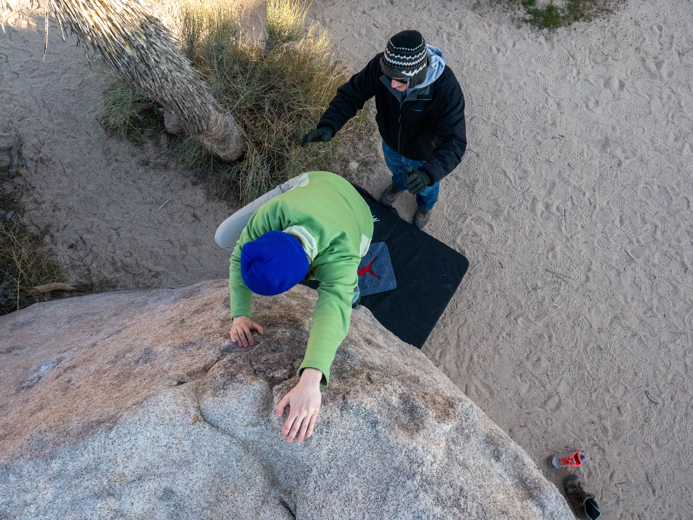

# FEWD-a01
FEWD assignment 1

## Hi, There!
I'm Juli. I love to: 
* rock climb
* play cribbage
* read
* write

Oh, and I'm a tad bit obsessed with Harry Potter (I'm a Hufflepuff).

## Whatcha doin' on GitHub?
I'm a graphic designer and developing my skills in web design. I know HTML and CSS fairly well, and now I'm moving on to learning JS. Currently, I am in the Front End Web Development Certificate Program at San Diego Continuing Education. For more info on the program, visit the [SDCE website](www.sdce.edu).
